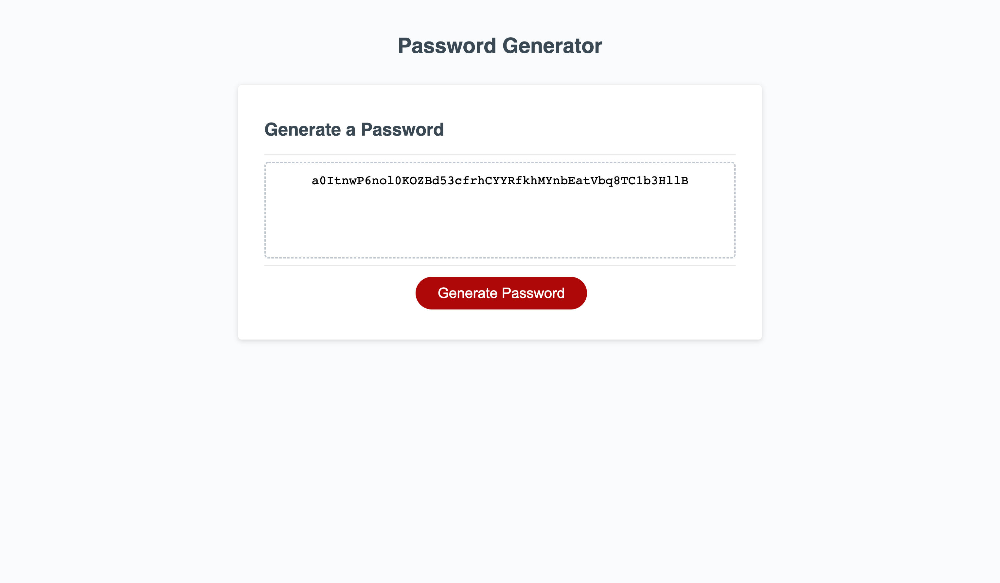

# password-generator

## Description

I had to provide functionality to an app that was meant to generate a random password based on certain user criteria. User was meant to decide the length of the password and what characters to use. The script was very incomplete when I took over this project but the HTML and CSS was working and functional. 

The app sends a series of window messages that asks both

A)How many times the index of characters is pulled from and applied to password 

B)Which of the predetermined indexes of character gets applied to the master index

The app then chooses a random number to choose from the index, and then applies that index item once to the password, and repeats this process the same amount of times as the number chosen in the first prompt. The final password is displayed in the empty box above the 'generate password' button.

## Installation

1. Thanks to the World Wide Web you can view this document from any net-connected device using the following HyperText Transfer Protocol Secure Address: https://deviousdoge.github.io/password-generator/

2. Source code can be viewed by cloning the repository found here to your local machine using git bash (PC) or HomeBrew (Mac): https://github.com/DeviousDoge/password-generator

3. Document is structured with index.html and styled with reset.css and style.css. Document is scripted with script.js.

## Usage

## Credits

Juliet Lamond (Major collaborator, helped greatly with concating the arrays and determining the logic of what the browser does when password does not meet length criteria)
Github:https://github.com/jlamond37

